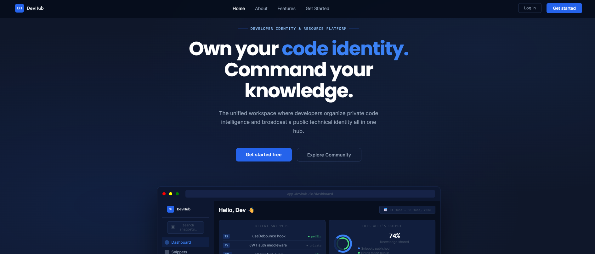
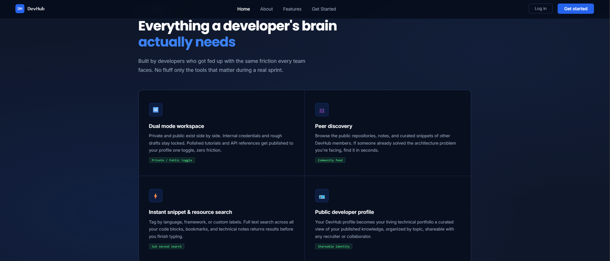
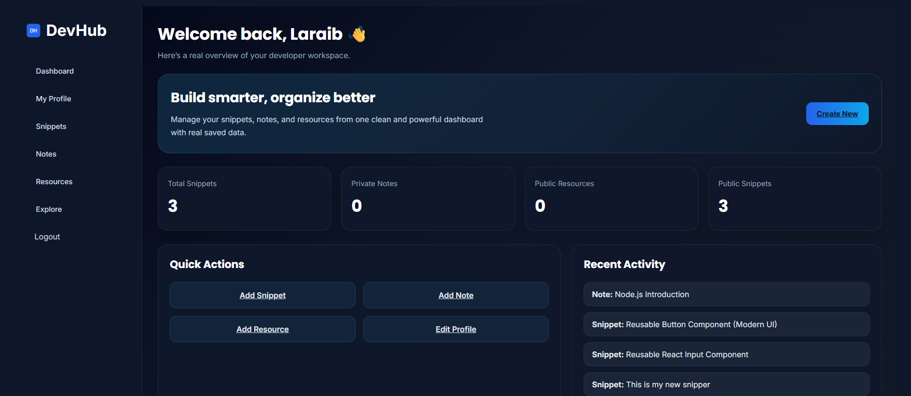
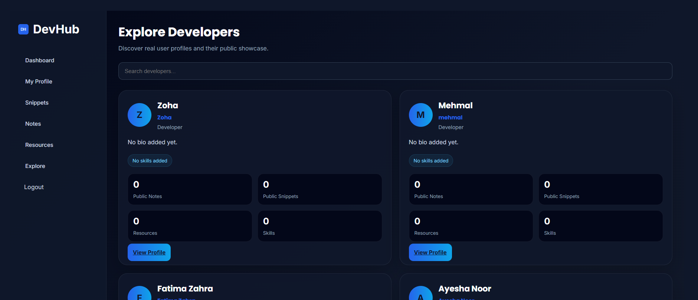
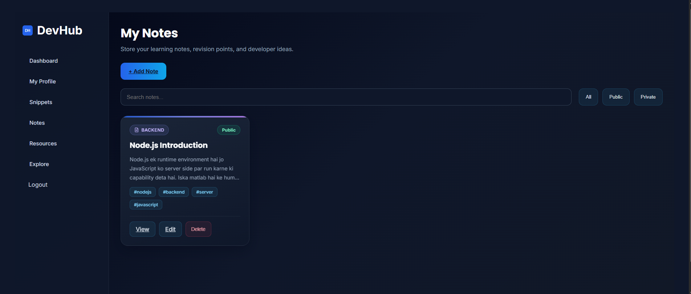

# DevHub

A full-stack developer collaboration platform where developers can organize notes, save code snippets, manage learning resources, and build a public technical profile.

---

## Overview

DevHub is designed to help developers keep their technical knowledge organized while also showcasing their public work. It combines personal productivity tools with community discovery features in a single platform.

---

## Features

### Authentication
- User registration and login
- Secure account management

### Notes Management
- Create, edit, and delete notes
- Public and private visibility options
- Search and filter notes
- Tag-based organization

### Code Snippets
- Store reusable code snippets
- Categorize snippets by technology
- Manage personal code library

### Resources
- Save useful learning resources and references
- Add descriptions, categories, and tags
- Public and private resource management

### Developer Profiles
- Custom developer profile
- Bio and skills showcase
- Public portfolio-style presence

### Explore Developers
- Discover other developers
- View public profiles
- Browse public notes, snippets, and resources

---

## Screenshots

### Home Page



### Features Section



### Dashboard


### Explore Developers



### Notes Dashboard



---

## Tech Stack

### Frontend
- React.js
- React Router
- CSS3
- React Icons

### Backend
- Node.js
- Express.js

### Database
- MongoDB
- Mongoose

---

## Project Structure

```text
DevHub
│
├── frontend
│   ├── components
│   ├── pages
│   ├── layouts
│   └── assets
│
├── backend
│   ├── models
│   ├── routes
│   ├── middleware
│   └── controllers
│
└── README.md
```

---

## Installation

### Clone Repository

```bash
git clone https://github.com/Laraib481/DevHub.git
```

### Install Frontend Dependencies

```bash
npm install
```

### Install Backend Dependencies

```bash
npm install
```

### Run Frontend

```bash
npm run dev
```

### Run Backend

```bash
npm start
```

---

## Future Improvements

- Real-time developer messaging
- Notifications system
- Bookmarking functionality
- Advanced search and filtering
- Profile customization
- Activity feed
- Deployment with cloud hosting

---

## Author

**Laraib**

Software Engineering Student

GitHub:
https://github.com/Laraib481

---

## Project Status

Currently under active development with continuous improvements to UI, user experience, and platform features.


